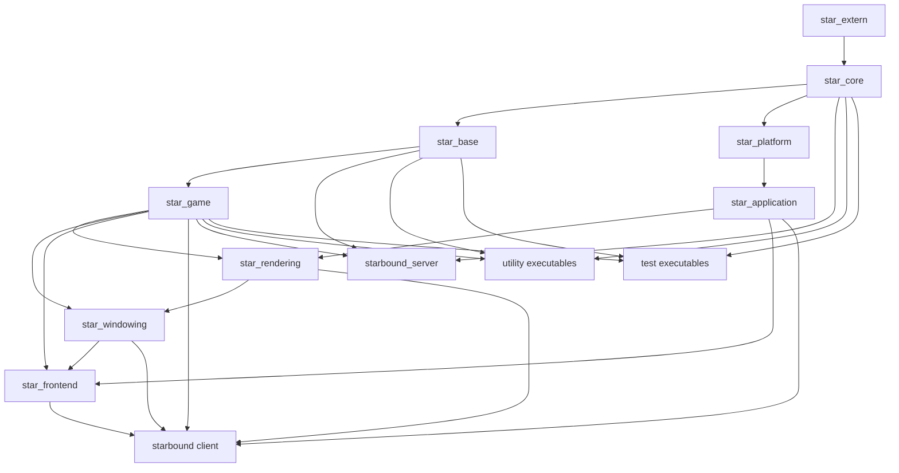

# OpenStarbound Architecture Guide

This document is a planning-oriented map of the OpenStarbound codebase. It is written for engineers who need to understand where behavior lives, how the client and server are composed, and which areas are likely to move together when a feature changes.

It focuses on the current repository structure under `source/`, the runtime boot flow, the asset and scripting model, and the coupling points that matter when planning modifications.

## Companion Docs

Use this guide as the entry point, then go deeper in the subsystem and planning documents under `doc/architecture/`:

- `doc/architecture/networking.md`
- `doc/architecture/persistence-versioning.md`
- `doc/architecture/client-ui.md`
- `doc/architecture/feature-impact-checklists.md`
- `doc/architecture/flows.md`
- `doc/architecture/performance-threading-review.md`
- `doc/architecture/multicore-engineering-plan.md`
- `doc/architecture/multicore-phase-roadmap.md`
- `doc/architecture/diagnostics-debugging-roadmap.md`

## 1. Executive Summary

OpenStarbound is a full C++ client and server derived from the original Starbound source tree, with an additional OpenStarbound asset overlay in `assets/opensb/`.

At a high level:

- `source/` contains the engine, gameplay, client, server, tooling, and tests.
- `assets/opensb/` contains OpenStarbound-specific content patches, scripts, configs, fonts, UI assets, and gameplay data overlays.
- The build is organized as layered CMake object libraries, then linked into top-level executables.
- The runtime is centered around a global `Root` object that owns assets, configuration, and lazily loaded gameplay databases.
- The server revolves around `UniverseServer`, which owns connections, active worlds, system worlds, and world lifecycle.
- The client revolves around `ClientApplication` and `UniverseClient`, which manage the local player, active world state, rendering, UI, and optional local single-player server hosting.

The most important architectural fact for planning changes is that gameplay, networking, persistence, scripting, and UI are not isolated vertical slices. They are joined by a few strong hubs:

- `Root` and its database accessors
- `UniverseServer` / `UniverseClient`
- `WorldServer` / `WorldClient`
- packet types and network sync structures
- Lua bindings and script components

Many changes that look local at the feature level will cross one or more of those hubs.

## 2. Repository Structure

The repository is split into source code, assets, packaging scripts, and domain documentation.

| Path | Role | Notes |
| --- | --- | --- |
| `source/` | C++ code and build configuration | Main codebase, CMake presets, vcpkg manifest |
| `assets/` | Runtime assets | Includes the OpenStarbound overlay and user-supplied Starbound assets |
| `doc/` | Project documentation | Existing Lua and JSON format docs live here |
| `scripts/` | Packaging, CI, formatting, distribution helpers | Used to assemble release artifacts |
| `lib/` | Platform-specific runtime libraries | Bundled binary dependencies for built distributions |
| `cmake/` | Find modules and build helpers | Dependency and platform detection |
| `triplets/`, `toolchains/` | Cross-platform build targeting | Used by vcpkg and cross compilation |
| `attic/` | Archived or historical material | Not part of the main runtime |

## 3. Build and Packaging Model

### 3.1 Build system

The project uses CMake with Ninja-oriented presets in `source/CMakePresets.json` and dependency management through `source/vcpkg.json`.

Important build characteristics:

- C++17 is required.
- The build supports Windows, Linux, and macOS presets.
- Steam and Discord integration are feature-gated build options.
- GUI builds are enabled through `STAR_BUILD_GUI`; server-only pieces still share most core/game code.
- The codebase uses object libraries (`star_core`, `star_base`, `star_game`, and so on) rather than a single monolithic static library.

### 3.2 Major build outputs

Primary outputs:

- `starbound`: the client executable
- `starbound_server`: the dedicated server executable

Additional outputs:

- utilities in `source/utility/` such as `asset_packer`, `asset_unpacker`, `btree_repacker`, `dump_versioned_json`, and `make_versioned_json`
- tests in `source/test/`: `core_tests` and `game_tests`
- optional Qt tools in `source/json_tool/` and `source/mod_uploader/`

### 3.3 Dependency model

The vcpkg manifest shows the main external dependencies:

- SDL3 for platform window/input/audio integration
- GLEW and OpenGL-adjacent rendering support
- Zlib, libpng, zstd, freetype, libvorbis, opus for asset and media handling
- `cpr` for HTTP
- `imgui` for debug and tooling UI integration
- `re2` and `abseil`
- allocator options such as `jemalloc`, `mimalloc`, and `rpmalloc`

### 3.4 Layered object-library graph

The build graph in `source/CMakeLists.txt` expresses the architecture cleanly.

Planning implication: the project is layered, but the top layers still link the lower ones directly. There is reuse, but not strict service isolation.

## 4. Source Module Map

### 4.1 `source/core/`

`core` is the foundation library. It contains low-level reusable infrastructure with minimal gameplay knowledge.

Responsibilities:

- containers and algorithms
- file and path abstractions
- JSON parsing and patching
- serialization and byte streams
- sockets, TCP, UDP, HTTP, addressing
- logging, exceptions, locking, threads, worker pools
- image, audio, font, compression, hashing, crypto helpers
- Lua runtime and conversion helpers
- network state/sync primitives such as `StarNetElement*`

Representative files:

- `StarJson.hpp`
- `StarThread.hpp`
- `StarWorkerPool.hpp`
- `StarTcp.hpp`
- `StarLua.hpp`
- `StarLogging.hpp`
- `StarNetElement.hpp`

Planning implication: changes here are widely amplified. Any modification in `core` should be treated as potentially global unless proven otherwise.

### 4.2 `source/base/`

`base` sits above `core` and provides the root asset/configuration substrate.

Responsibilities:

- asset source abstraction and composition
- packed and directory asset loading
- TTL asset caching
- configuration loading and merge behavior
- root bootstrap helpers reused by gameplay code

Representative files:

- `StarAssets.hpp`
- `StarAssetSource.hpp`
- `StarDirectoryAssetSource.hpp`
- `StarPackedAssetSource.hpp`
- `StarConfiguration.hpp`
- `StarRootBase.hpp`

Planning implication: this layer is the bridge between filesystem content and runtime systems. Asset pipeline changes tend to affect both client and server.

### 4.3 `source/platform/`

`platform` contains abstract service contracts that hide platform or storefront integrations.

Responsibilities:

- P2P networking service abstraction
- statistics/achievement abstraction
- user-generated content abstraction

Representative files:

- `StarP2PNetworkingService.hpp`
- `StarStatisticsService.hpp`
- `StarUserGeneratedContentService.hpp`

Planning implication: this is a seam for Steam/Discord/desktop-specific behavior. It is a good layer to extend when adding integrations without contaminating gameplay code directly.

### 4.4 `source/application/`

`application` contains platform-aware application bootstrapping and rendering integration.

Responsibilities:

- SDL-based process bootstrap
- application controller abstraction
- renderer abstraction and OpenGL implementation
- desktop/platform services for PC
- optional Steam and Discord service implementations

Representative files:

- `StarApplication.hpp`
- `StarApplicationController.hpp`
- `StarMainApplication.hpp`
- `StarMainApplication_sdl.cpp`
- `StarRenderer.hpp`
- `StarRenderer_opengl.cpp`
- `StarPlatformServices_pc.cpp`

Planning implication: if a change involves window lifecycle, clipboard, display mode, input dispatch, or renderer bootstrapping, this is the first place to inspect.

### 4.5 `source/game/`

`game` is the domain core. It contains almost all gameplay, simulation, persistence, networking protocol, and content database logic.

Responsibilities:

- root/database access through `Root` and `RootLoader`
- entity system: players, monsters, NPCs, objects, projectiles, vehicles, stagehands
- world model and world simulation
- universe model, world lifecycle, ship/system handling
- procedural generation and celestial data
- gameplay databases and content indexing
- net packets and packet sockets
- questing, stats, tech, tenants, collections, codexes, behavior trees
- scripting integration and Lua bindings for gameplay surfaces
- save/versioning and world/player storage

Representative files:

- `StarRoot.hpp`
- `StarRootLoader.hpp`
- `StarUniverseServer.hpp`
- `StarUniverseClient.hpp`
- `StarWorldServer.hpp`
- `StarWorldClient.hpp`
- `StarWorldStorage.hpp`
- `StarNetPackets.hpp`
- `StarEntityFactory.hpp`
- `StarPlayer.hpp`
- `scripting/StarWorldLuaBindings.hpp`
- `scripting/StarUniverseServerLuaBindings.hpp`
- `scripting/StarScriptableThread.hpp`

Planning implication: most feature work lands here. It is also the highest-coupling module.

### 4.6 `source/rendering/`

`rendering` turns gameplay/render data into draw calls and texture management.

Responsibilities:

- world painting
- tile rendering
- environment and drawable painting
- text and font texture grouping
- asset texture grouping

Representative files:

- `StarWorldPainter.hpp`
- `StarTilePainter.hpp`
- `StarEnvironmentPainter.hpp`
- `StarDrawablePainter.hpp`
- `StarAssetTextureGroup.hpp`

Planning implication: this is the right layer for visual output changes that should not change underlying simulation or UI widget logic.

### 4.7 `source/windowing/`

`windowing` is the in-game GUI toolkit.

Responsibilities:

- widget primitives
- pane management
- layouts and widget parsing
- input-to-widget translation
- GUI context and asset-driven pane loading

Representative files:

- `StarWidget.hpp`
- `StarPane.hpp`
- `StarPaneManager.hpp`
- `StarGuiContext.hpp`
- `StarGuiReader.hpp`
- `StarWidgetLuaBindings.hpp`

Planning implication: UI framework changes here affect all menus and in-game panes, not just a single feature screen.

### 4.8 `source/frontend/`

`frontend` is the concrete game UI layer built on top of `windowing`, `rendering`, and `game`.

Responsibilities:

- title flow and menus
- inventory, crafting, quest, codex, chat, team, teleport, options, bindings, shaders, and voice interfaces
- main HUD and interaction panes
- client-side command processing
- interface Lua bindings

Representative files:

- `StarMainInterface.hpp`
- `StarTitleScreen.hpp`
- `StarInventory.hpp`
- `StarCraftingInterface.hpp`
- `StarChat.hpp`
- `StarOptionsMenu.hpp`
- `StarBindingsMenu.hpp`
- `StarVoice.hpp`

Planning implication: feature UI changes usually live here, but they often depend directly on `UniverseClient`, `WorldClient`, and `Player` APIs.

### 4.9 `source/client/`

`client` is the client-specific executable layer.

Responsibilities:

- top-level client application class
- client process composition across engine, rendering, UI, and gameplay
- single-player hosting by spinning up a local `UniverseServer`

Representative files:

- `StarClientApplication.hpp`
- `StarClientApplication.cpp`
- `StarRenderingLuaBindings.cpp`

Planning implication: when a change is about app state transitions, single-player boot, multiplayer connection orchestration, or client-wide update/render order, start here.

### 4.10 `source/server/`

`server` is the dedicated-server executable layer.

Responsibilities:

- dedicated server entry point
- query server and RCON threads
- dedicated server process wiring around `UniverseServer`

Representative files:

- `main.cpp`
- `StarServerQueryThread.hpp`
- `StarServerRconThread.hpp`
- `StarServerRconClient.hpp`

Planning implication: this layer is small. Most server behavior lives in `game`, not `server`.

### 4.11 `source/utility/`

Standalone tools that operate on assets or versioned data.

Examples:

- `asset_packer`
- `asset_unpacker`
- `btree_repacker`
- `dump_versioned_json`
- `make_versioned_json`

Planning implication: useful for tooling or pipeline work without changing the main runtime.

### 4.12 `source/test/`

GTest-based automated tests.

Coverage areas include:

- core algorithms and containers
- serialization and JSON behavior
- Lua behavior
- asset loading
- root bootstrap
- server/universe connection flows
- gameplay data structures

Planning implication: not every runtime path is covered, but this is the main executable safety net for low-level and selected gameplay behavior.

## 5. Runtime Boot and Ownership Model

### 5.1 Root bootstrap

The runtime starts by building a `Root` through `RootLoader`.

`RootLoader` is responsible for merging three sources of boot information:

- built-in defaults passed to its constructor
- the boot config file, usually `sbinit.config`
- command-line overrides

Important boot responsibilities handled here:

- asset directories and asset sources
- storage directory
- runtime configuration path
- logging target and log level
- default configuration merge

`Root` then becomes the global runtime hub.

Key `Root` behaviors:

- owns `Assets` and `Configuration`
- lazy-loads gameplay databases on first access
- exposes storage-relative path translation
- supports reload and mod reloading
- runs maintenance for runtime config persistence and reload listeners

Planning implication: nearly every system depends on `Root` either directly or indirectly. This makes startup consistent, but also creates broad coupling.

### 5.2 Asset ownership

`Assets` is thread-safe and uses TTL caching plus a worker pool.

It supports multiple asset source types:

- directory sources
- packed asset files
- in-memory sources

It also supports patch application and post-processing over loaded assets.

Asset types handled centrally:

- JSON
- images
- audio
- fonts
- raw bytes

Planning implication: content-driven changes often do not stop at `assets/`. The asset subsystem itself performs merging, patching, caching, and background loading.

### 5.3 Client boot flow

The client executable links the full stack and uses `ClientApplication` as its game-facing application implementation.

`ClientApplication` contains a top-level state machine with states including:

- `Startup`
- `SteamFlatpakWarning`
- `Mods`
- `ModsWarning`
- `Splash`
- `Error`
- `Title`
- `SinglePlayer`
- `MultiPlayer`

Important client-owned objects include:

- `Root`
- `UniverseClient`
- `WorldPainter`
- `MainInterface`
- `MainMixer`
- `TitleScreen`
- optional local `UniverseServer` during single-player

Client planning model:

1. bootstrap windowing/render/application services
2. build `Root`
3. initialize UI and presentation systems
4. initialize or connect `UniverseClient`
5. optionally start an in-process `UniverseServer` for local play
6. render world and UI each frame while processing input and audio

### 5.4 Server boot flow

The dedicated server entry point in `source/server/main.cpp` is intentionally thin.

It does the following:

1. create a `RootLoader` with server-specific default config
2. initialize `Root`
3. fully load runtime data
4. build `UniverseServer` against the storage directory
5. enable TCP listening
6. optionally start query and RCON services
7. run until interrupted, then stop and join all server threads cleanly

Planning implication: dedicated-server changes almost always land in `UniverseServer`, world handling, or packet processing, not in `main.cpp`.

## 6. World, Universe, and Gameplay Model

### 6.1 Universe-level ownership

`UniverseServer` is the server-side runtime coordinator.

Responsibilities called out in its interface and fields include:

- connection acceptance and removal
- world and system world creation
- client context management
- chat and admin command handling
- team updates
- warp and flight orchestration
- celestial request handling
- storage triggering
- Lua script startup/update/shutdown
- timeouts, bans, and cleanup of dead connections

Important internal structures:

- active clients map
- active worlds map, where worlds may be loaded or still being created via worker-pool promises
- active system worlds map
- pending warps, flights, chat, planet updates, world messages, and celestial requests
- a shared pause flag and universe clock

Planning implication: `UniverseServer` is the central server integration point. Any feature touching world routing, login/connection state, player movement between worlds, or administrative behavior should be expected to interact with it.

### 6.2 Client-side universe model

`UniverseClient` mirrors the connection-oriented side of the runtime.

Responsibilities:

- connect and disconnect from a `UniverseConnection`
- own the active `WorldClient` or `SystemWorldClient`
- track server info and disconnect reason
- route incoming packets into client state
- own client-side Lua script contexts
- coordinate warp requests, respawn timing, quest manager, team client, and celestial data

Planning implication: most gameplay-facing client screens and player actions eventually flow through `UniverseClient`.

### 6.3 World simulation

`WorldServer` is the authoritative world simulation.

Responsibilities visible in its API:

- tile and liquid state
- entities and entity lookup
- damage and tile modification
- world properties and timers
- interaction handling
- gravity, environment, weather, and world conditions
- world messaging
- per-client packet intake and output
- Lua world scripting
- world fidelity control and expiry management

Important detail: `WorldServer` is not just a data store. It is the active simulation authority and networking endpoint for a loaded world.

`WorldClient` is the client-side world representation used for rendering, local interaction support, and packet-driven world state updates.

### 6.4 World threading model

Loaded worlds do not all run directly inside `UniverseServer`.

`WorldServerThread` wraps a `WorldServer` and runs it in its own thread. It provides:

- guarded lifecycle control
- incoming and outgoing packet queues per client
- update callbacks back into `UniverseServer`
- thread-safe world actions
- error containment and world-expiry handling

Planning implication: many server-side bugs are not just logic bugs; they are ownership and thread-boundary bugs between `UniverseServer`, `WorldServerThread`, and `WorldServer`.

### 6.5 Entities and factories

The game module defines a wide entity hierarchy and several factories and databases that bridge content data to live runtime objects.

Major entity families include:

- players
- monsters
- NPCs
- objects
- projectiles
- vehicles
- stagehands
- plants and tile entities

Key enabling systems:

- `EntityFactory`
- `PlayerFactory`
- content databases for species, items, materials, projectiles, objects, monsters, tenants, tech, quests, and more

Planning implication: adding or altering a gameplay type often involves data definitions, factory registration, save/network representation, and script bindings together.

## 7. Networking Model

Networking is packet-based.

The fundamental abstraction is `UniverseConnection`, a symmetric packet connection between client and server backed by a `PacketSocket`.

Key characteristics:

- send and receive queues are explicit
- non-blocking and blocking send/receive APIs exist
- stats may be collected from the underlying packet socket
- connections can be local or remote

`UniverseConnectionServer` manages many connections asynchronously using worker threads and packet receive callbacks.

Planning implication: there are two separate concerns when changing networking:

- protocol definition and packet semantics
- asynchronous connection/server processing behavior

Those two concerns meet at `UniverseServer`, `UniverseClient`, and world packet handlers.

### 7.1 Protocol and state sync

The protocol surface lives in `StarNetPackets.hpp` and related packet/socket classes.

The sync model also relies heavily on `StarNetElement*` types from `core/` for synchronized fields and state groups.

When planning a networked gameplay change, expect to touch some combination of:

- packet types
- client packet handling
- server packet handling
- save/load or entity state serialization
- compatibility or protocol version checks

### 7.2 Server-side auxiliary network services

The dedicated server executable adds:

- query server support
- RCON support

These are in `source/server/` and are operational extensions on top of the main gameplay server.

## 8. Rendering and UI Model

The client presentation stack is layered rather than monolithic.

### 8.1 Rendering

`rendering/` is responsible for taking world and asset-derived render data and painting it.

Typical ownership split:

- simulation and render data generation in `game/`
- draw orchestration in `rendering/`
- actual process and graphics API integration in `application/`

Planning implication: visual changes should try to stay in `rendering/` if they do not alter gameplay state.

### 8.2 Windowing toolkit

`windowing/` provides the reusable pane/widget framework for the in-game UI.

This is effectively a project-specific UI toolkit with:

- widgets
- layout containers
- pane hierarchies
- GUI context
- pane loading and parsing from asset data

Planning implication: changes to widget behaviors or GUI layout parsing have broad UI impact.

### 8.3 Frontend layer

`frontend/` defines the actual game-facing interfaces and HUD.

This layer depends directly on runtime game objects such as:

- `UniverseClient`
- `WorldClient`
- `Player`
- painter types from `rendering/`

Planning implication: UI logic and gameplay logic are close together here. Many screens are thin wrappers over live runtime objects rather than isolated view models.

## 9. Scripting and Data-Driven Extension Model

Lua is a first-class part of the runtime.

There are bindings in `core/`, `game/scripting/`, `windowing/`, `frontend/`, and `client/`.

Important scripting characteristics:

- Lua callbacks are grouped and installed per subsystem
- gameplay worlds expose Lua surfaces
- universe/server behavior exposes Lua surfaces
- scriptable components can update over time and receive messages
- script threads exist via `ScriptableThread`

Planning implication: code changes that alter behavior surface area may require synchronized changes in both C++ and Lua APIs.

### 9.1 Asset-driven scripting overlay

`assets/opensb/` is not just static content. It includes:

- config patches such as `client.config.patch`, `player.config.patch`, `worldserver.config.patch`, and `universe_server.config.patch`
- scripts under `assets/opensb/scripts/`
- UI and cursor assets
- additional fonts
- SFX and visual content
- versioning data
- preload configuration

This means OpenStarbound functionality is split between engine/runtime changes and overlay content changes.

Planning implication: many features can only be understood by looking at both `source/` and `assets/opensb/` together.

## 10. Persistence and Versioning Model

Persistence is spread across several systems rather than centralized into one storage service.

Key persistence surfaces:

- `WorldStorage` and related world/chunk data
- player storage and saved-player structures
- versioning database and migration helpers
- B-tree storage utilities in `core/`
- runtime config persistence owned by `Root`

Planning implication: any change to stored gameplay state should be evaluated for:

- backward compatibility
- migration/versioning requirements
- client/server state transfer impact
- interaction with tools like `dump_versioned_json` or `make_versioned_json`

## 11. Assets and Mod Overlay Model

OpenStarbound ships code plus its own overlay assets, but relies on owned Starbound assets for the full playable asset set.

Operationally, the runtime expects boot configuration to point at asset directories or packed sources such as `packed.pak`, then applies overlay content and patches on top.

Architectural consequences:

- behavior can be changed through code, overlay assets, or both
- config patches can alter baseline runtime behavior without recompiling code
- asset digesting matters for multiplayer compatibility checks
- mods are part of the boot and reload story, not an afterthought

This makes OpenStarbound closer to a data-driven game platform than a pure hardcoded executable.

## 12. Threading and Concurrency

Concurrency is pervasive.

Main concurrency surfaces include:

- asset worker pool in `Assets`
- worker pools in universe/world creation paths
- `UniverseServer` as its own thread
- one thread per active `WorldServerThread`
- asynchronous packet processing in `UniverseConnectionServer`
- script thread support through `ScriptableThread`

Planning implication: a design is not complete until ownership, lifetime, and thread-affinity are clear.

Questions to answer for any non-trivial server or asset change:

- which thread owns mutation?
- who queues work and who consumes it?
- what happens if a world unloads mid-operation?
- what survives reload or reconnect?
- what must be synchronized across server and client?

## 13. Testing and Verification Surfaces

The current automated tests are concentrated in `source/test/`.

`core_tests` focuses on foundational correctness.

Examples:

- data structures
- threading helpers
- JSON and serialization
- Lua and parsing
- hashing and math

`game_tests` covers selected domain flows.

Examples:

- asset loading
- root initialization
- items and stats
- spawn behavior
- server behavior
- universe connections

Planning implication: tests exist, but they do not fully cover the client presentation stack or all live gameplay paths. Feature work will still require targeted manual validation.

## 14. Change Planning Matrix

This section is intended to help a team estimate impact before coding.

| Change type | Start in | Usually also touches | Risk level |
| --- | --- | --- | --- |
| New gameplay item/entity behavior | `source/game/` | assets, Lua bindings, persistence, packets, UI | High |
| New UI screen or HUD behavior | `source/frontend/` | `windowing/`, `game/`, assets | Medium to High |
| Visual-only world rendering change | `source/rendering/` | `application/`, `game/` render data | Medium |
| New input or window/platform behavior | `source/application/`, `source/windowing/` | `frontend/`, client app state | Medium |
| Dedicated server admin/query/RCON feature | `source/server/`, `source/game/` | config, command processing, Lua | Medium |
| Asset loading, patching, or mod behavior | `source/base/`, `source/game/StarRoot*` | assets, multiplayer digest/compatibility | High |
| Network protocol change | `source/game/StarNetPackets*` | client/server handlers, sync code, compatibility, tests | Very High |
| Save format or versioning change | `source/game/`, versioning data, utility tools | migration, tests, backward compatibility | Very High |
| Steam/Discord/platform integration change | `source/platform/`, `source/application/` | build config, optional feature flags | Medium |
| Tooling or content pipeline change | `source/utility/`, scripts | build and release assembly | Low to Medium |

## 15. High-Coupling Areas and Risks

### 15.1 `Root` as a global service locator

Strength:

- central, predictable bootstrap and access to content/runtime databases

Risk:

- broad implicit dependency graph
- difficult isolated testing
- easy to introduce hidden transitive coupling

### 15.2 Gameplay plus protocol plus persistence overlap

Entity and world changes often require synchronized updates in:

- simulation logic
- packet flow
- serialization
- scripts
- UI
- saved data versioning

Risk:

- a seemingly local feature change can break multiplayer or old saves

### 15.3 Thread-bound world ownership

The server is intentionally threaded by world and connection processing.

Risk:

- lifecycle races
- stale handles to worlds or players
- action ordering bugs between queued work and world unloads

### 15.4 Data-driven plus code-driven behavior split

OpenStarbound behavior may be implemented partly in C++ and partly in `assets/opensb/`.

Risk:

- reviewing only code or only assets gives an incomplete picture

## 16. Suggested Reading Order for New Contributors

For general orientation:

1. `README.md`
2. `source/CMakeLists.txt`
3. `source/CMakePresets.json`
4. `source/client/CMakeLists.txt` and `source/server/CMakeLists.txt`
5. `source/game/StarRootLoader.hpp`
6. `source/game/StarRoot.hpp`
7. `source/game/StarUniverseServer.hpp`
8. `source/game/StarUniverseClient.hpp`
9. `source/game/StarWorldServer.hpp`
10. `source/client/StarClientApplication.hpp`
11. `source/frontend/StarMainInterface.hpp`
12. `assets/opensb/` patches and scripts related to the feature area

For client feature work:

1. `source/client/StarClientApplication.*`
2. `source/frontend/` feature pane(s)
3. `source/windowing/` primitives involved
4. `source/game/UniverseClient`, `WorldClient`, `Player`, or related domain types
5. related asset configs and scripts

For server/gameplay feature work:

1. `source/game/StarUniverseServer.*`
2. `source/game/StarWorldServer.*`
3. relevant entity/database/factory code
4. packet and script bindings
5. persistence/versioning if the feature stores state

## 17. Recommended Team Planning Heuristics

Before starting a feature or refactor, classify it first.

Use these categories:

- content-only
- engine/runtime-only
- gameplay simulation
- network protocol
- UI/presentation
- persistence/versioning
- platform integration

Then answer these questions explicitly:

1. Does this change alter the authoritative simulation or only presentation?
2. Does the change need to work in both single-player and dedicated server mode?
3. Does it change packet structure, entity sync, or protocol assumptions?
4. Does it alter saved data or runtime config semantics?
5. Does it require a Lua binding or asset patch change?
6. Which thread owns the new behavior?
7. What is the rollback path if mods or old saves encounter the new logic?

If the team answers those questions up front, change planning becomes much more predictable in this codebase.

## 18. Practical Takeaways

- Treat `game/` as the domain center, not just another module.
- Treat `Root` and the asset layer as architectural infrastructure, not utility code.
- Assume most gameplay features cross code, assets, and scripting together.
- Be conservative with packet, persistence, and thread-affinity changes.
- Prefer using `platform/`, `application/`, and `windowing/` as seams rather than bypassing them from feature code.
- When in doubt, inspect both the C++ implementation and the matching `assets/opensb/` overlay for the feature.

---

This guide should be maintained as a living engineering document. The best next improvement would be to add focused subsystem documents for networking, persistence/versioning, and the client UI stack, since those are the three areas where change coordination is most expensive.