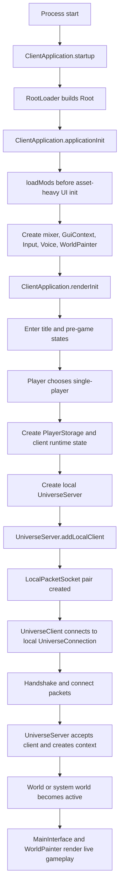
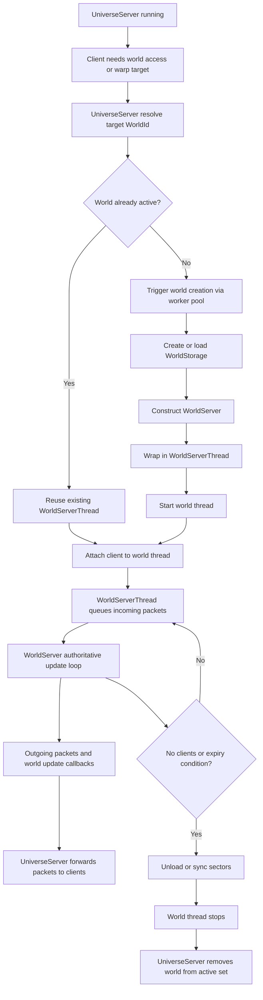
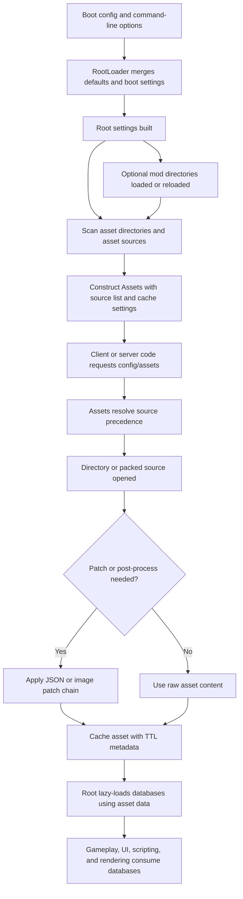

# OpenStarbound Architecture Flows

This document adds concrete flow diagrams to the higher-level architecture guide.

The diagrams are intentionally operational rather than theoretical. They are meant to help engineers trace ownership and lifecycle across the most expensive change paths.

## 1. Single-Player Boot Flow

This flow shows how the client boots, loads content, and then starts a local server while still using the shared client/server networking model.

Critical notes:

- Single-player still uses most of the same packet and routing paths as multiplayer.
- Mod loading happens before asset-heavy client initialization.
- Client UI and world rendering are booted before gameplay begins, but after root and configuration setup.

## 2. Server World Lifecycle

This flow shows how `UniverseServer`, `WorldServerThread`, and `WorldServer` cooperate to create, run, and retire active worlds.

Critical notes:

- World persistence and world simulation are coupled through `WorldStorage`.
- `UniverseServer` decides world ownership and routing, but `WorldServer` owns authoritative world mutation.
- Unload behavior is part of the runtime loop, not just process shutdown behavior.

## 3. Asset and Mod Loading Flow

This flow shows how boot-time content sources become live assets and runtime databases.

Critical notes:

- Asset source ordering matters because it determines override behavior.
- `Assets` handles patching and caching, not just raw file reads.
- Many runtime systems only become concrete when `Root` lazy-loads a database on first access.

## 4. How To Use These Diagrams In Planning

When a change is proposed, start by choosing the flow it belongs to most strongly.

- Single-player boot and startup behavior: use the single-player boot diagram.
- World creation, routing, and unload logic: use the server world lifecycle diagram.
- Content bootstrap, mods, patches, and runtime data availability: use the asset and mod loading diagram.

If a feature crosses two diagrams, assume the change is medium or high risk and plan validation earlier.